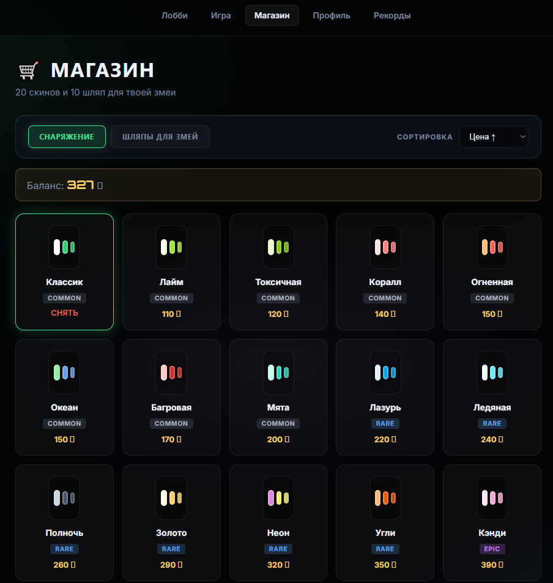
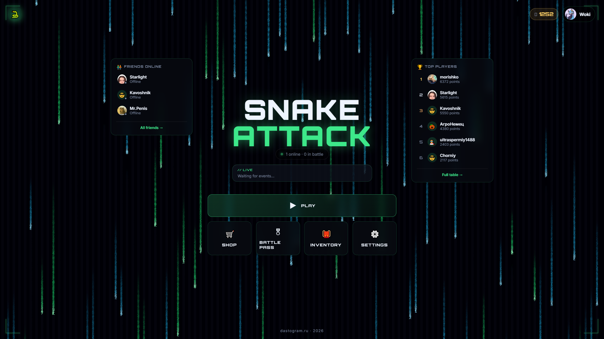
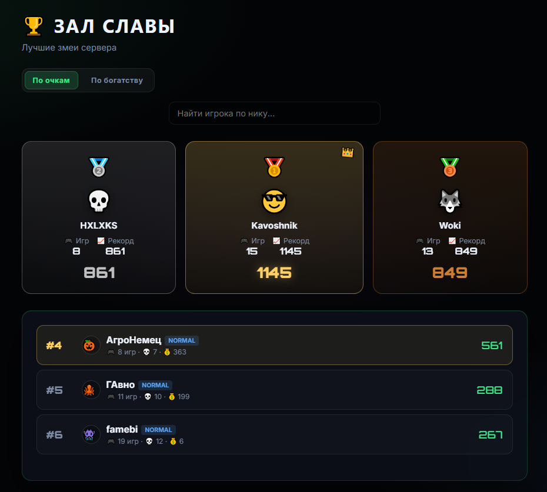
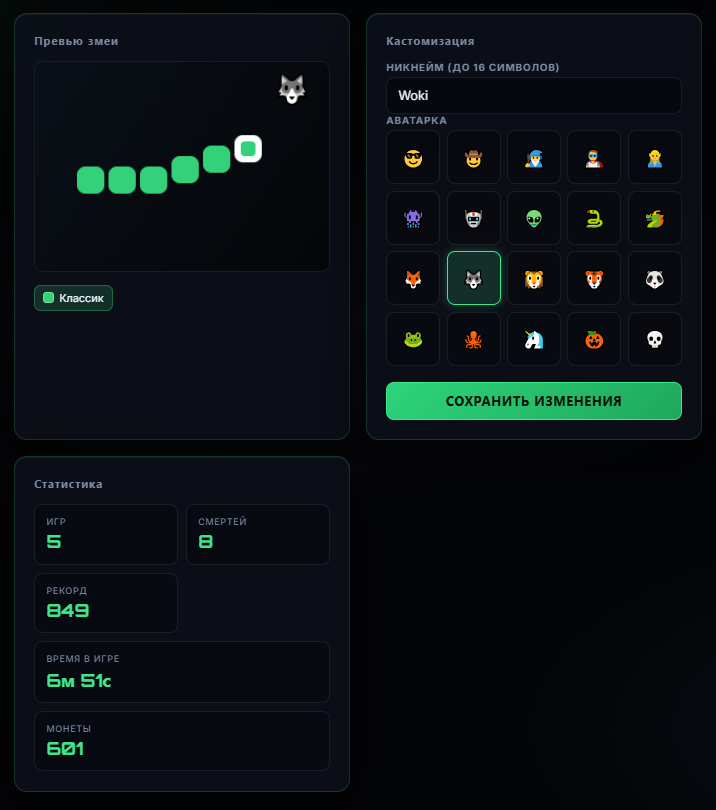
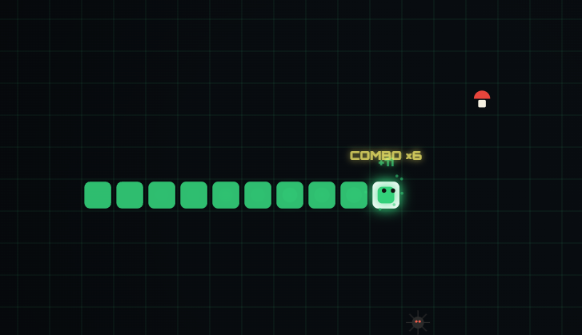
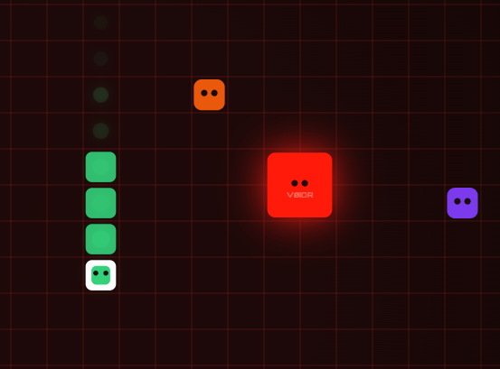

<!-- БАННЕР -->

  

 

<!-- ЛОГОТИП -->

  

<h1 align="center">THE ULTIMATE MULTIPLAYER SNAKE ATTACK</h1>
<h2 align="center" style="color: #00ff88;">INFINITE DARKNESS EDITION</h2>
<h3 align="center"><i>— THE LAST STAND OF THE PRIMEVAL SERPENT EMPIRE —</i></h3>

  <strong>2026 REMASTERED DIRECTOR'S CUT</strong> 
  <small>с эксклюзивными аренами, легендарными скинами, динамической погодой и расширенной кооперативной кампанией</small>

 

  
  
  
  

  
  
  
  

  <strong>Мультиплеерная змейка нового поколения с боссами, бонусами, магазином и таблицей рекордов.</strong> 
  Играйте с друзьями по сети, сражайтесь с эпическими боссами и открывайте легендарные скины.

---

## СОДЕРЖАНИЕ

- [Трейлер и Галерея](#трейлер-и-галерея)
- [Особенности](#особенности)
- [Геймплей](#геймплей)
- [Магазин и Кастомизация](#магазин-и-кастомизация)
- [Таблица рекордов](#таблица-рекордов)
- [Технологии](#технологии)
- [Лицензия](#лицензия)
- [Контрибьюторы](#контрибьюторы)

---

# ГАЛЕРЕЯ
  

<table align="center" border="0" cellpadding="20">
  </tr>
  <tr>
    <td align="center">
      
       <strong>Магазин скинов</strong>
    </td>
    <td align="center">
      
       <strong>Мега крутое лобби</strong>
    </td>
    <td align="center">
      
       <strong>Лидерборд</strong>
    </td>
  </tr>
</table>

  

  
  
  

  <em>Скриншоты игрового процесса, магазина, таблицы рекордов и профиля игрока</em>

---

## ОСОБЕННОСТИ

<table align="center" border="0" cellpadding="20">
  <tr>
    <td align="center" style="background: linear-gradient(135deg, #667eea 0%, #764ba2 100%); border-radius: 15px; padding: 25px;">
      <h3>Геймплей</h3>
      <ul align="left">
        <li>Классическая змейка с фруктами</li>
        <li>Яблоко, вишня, виноград</li>
        <li>Избегайте ядов (гниль, паук)</li>
        <li>Сбор монет и очков</li>
      </ul>
    </td>
    <td align="center" style="background: linear-gradient(135deg, #f093fb 0%, #f5576c 100%); border-radius: 15px; padding: 25px;">
      <h3>Бонусы</h3>
      <ul align="left">
        <li>Щит — защита от ядов</li>
        <li>Ускорение и замедление —  изменение скорости змейки</li>
        <li>x2 монет — двойной сбор валюты</li>
        <li>Призрак — проход сквозь других</li>
      </ul>
    </td>
    <td align="center" style="background: linear-gradient(135deg, #4facfe 0%, #00f2fe 100%); border-radius: 15px; padding: 25px;">
      <h3>Боссы</h3>
      <ul align="left">
        <li>Несколько боссов-преследователей</li>
        <li>Режим ярости</li>
        <li>Кооперативное выживание</li>
        <li>Уникальные механики</li>
        <li>Эпические награды</li>
      </ul>
    </td>
  </tr>
  <tr>
    <td align="center" style="background: linear-gradient(135deg, #43e97b 0%, #38f9d7 100%); border-radius: 15px; padding: 25px;">
      <h3>Прогресс</h3>
      <ul align="left">
        <li>PostgreSQL лидерборд</li>
        <li>Сохранение профиля</li>
        <li>Статистика игр</li>
        <li>Достижения</li>
        <li>Рейтинг игроков</li>
      </ul>
    </td>
    <td align="center" style="background: linear-gradient(135deg, #fa709a 0%, #fee140 100%); border-radius: 15px; padding: 25px;">
      <h3>Кастомизация</h3>
      <ul align="left">
        <li>Уникальные скины</li>
        <li>Магазин за монеты</li>
        <li>Легендарные скины</li>
        <li>Особые эффекты</li>
      </ul>
    </td>
    <td align="center" style="background: linear-gradient(135deg, #a8edea 0%, #fed6e3 100%); border-radius: 15px; padding: 25px;">
      <h3>Мультиплеер</h3>
      <ul align="left">
        <li>Онлайн без лимита</li>
        <li>WebSocket real-time</li>
        <li>Кооперативный режим</li>
        <li>Игра с друзьями</li>
      </ul>
    </td>
  </tr>
</table>

---

## ГЕЙМПЛЕЙ

  

 

---

## МАГАЗИН И КАСТОМИЗАЦИЯ

  

 

### Категории скинов

| Редкость | Стоимость | Особенности |
|----------|-----------|-------------|
| Обычные | 10-50 монет | Базовые расцветки |
| Редкие | 100-250 монет | Уникальные дизайны |
| Эпические | 500-1000 монет | Анимированные эффекты |
| Легендарные | 2500+ монет | Особые визуальные эффекты |
| Эксклюзивные | События | Ограниченные серии |

---

## ТАБЛИЦА РЕКОРДОВ

  

 

### Система рейтинга

| Позиция | Награда |
|---------|---------|
| Топ 1 | Золотая рамка |
| Топ 2 | Серебряная рамка |
| Топ 3 | Бронзовая рамка |

---

## ТЕХНОЛОГИИ

  
  
  
  
  
  

 

### Backend
- **Node.js + Express** — REST API и WebSocket сервер
- **PostgreSQL** — хранение профилей, инвентаря, рекордов
- **WebSocket (Socket.io)** — real-time мультиплеер
- **JWT** — аутентификация

### Frontend
- **HTML5 Canvas** — рендеринг игры
- **CSS3** — анимации и стилизация
- **Vanilla JavaScript** — игровая логика

### DevOps
- **Git** — контроль версий
- **npm** — пакетный менеджер

---

## ЛИЦЕНЗИЯ

Этот проект распространяется под лицензией MIT. Подробнее см. в файле [LICENSE](LICENSE).

## КОНТРИБЬЮТОРЫ

  <a href="https://github.com/KaVoshnik" style="display: inline-flex; flex-direction: column; align-items: center; margin: 0 30px; text-decoration: none;">
    
    KaVoshnik
  </a>
  <a href="https://github.com/IWoki" style="display: inline-flex; flex-direction: column; align-items: center; margin: 0 30px; text-decoration: none;">
    
    IWoki
  </a>

  <strong style="color: #fff;">Мега крутые разрабы змеек</strong>

  
  
  

