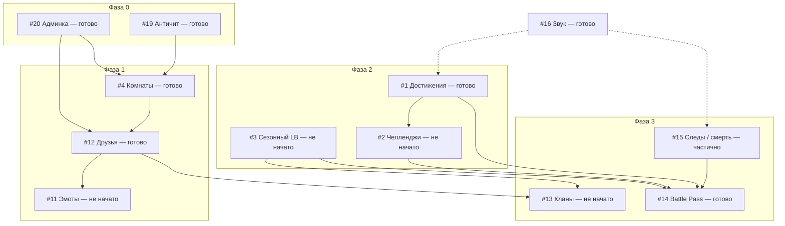

# Roadmap — Multiplayer Ultimate Snake Attack

Документ описывает план развития игры по **14 выбранным направлениям**.
Статус на момент составления (июнь 2026): базовый мультиплеер, магазин, Google-профили, лидерборд, бонусы, боссы, kill feed, кастомные PNG-скины — **готовы**.

**Обновление (июль 2026, часть 1):** сверено с фактическим кодом. С июня дополнительно готовы: `#4` приватные комнаты, `#12` друзья, `#1` достижения (16 шт.), `#20` админ-панель (без live-kick активных игроков), `#14` battle pass (60 тиров), а также daily streak и система наград за него (вне исходного списка 14 пунктов). Система сложностей (`difficulty`) при этом **полностью удалена** — пункт `#5` ниже переработан.

**Обновление (июль 2026, часть 2):** `#19` rate-limit/anti-flood реализован (`lib/rate-limiter.js` + защита от дублей сессий по `google_id`). Также исправлена ошибочная оценка `#16` из предыдущей правки этого документа: звук на самом деле был почти полностью подключён и уже работал (eat/combo/death/highscore/boss/ui) — предыдущая пометка «не начато» была основана на неверном прочтении eslint-warning про неиспользуемую переменную в её собственном файле (ложный сигнал для script-тегов без модулей). Реально не хватало только двух конкретных вещей — звука ачивки и звука подбора бонуса — оба добавлены.

**Продакшен:** [dastogram.ru](https://dastogram.ru)
**Стек:** `server.js` + WebSocket (собственная реализация протокола, без библиотеки `ws`), `public/`, PostgreSQL (`db.js`), Google OAuth (`auth.js`)

---

## Сводка по фазам

| Фаза | Фокус | Фичи | Статус | Ориентир |
|------|--------|------|--------|----------|
| **0** | Фундамент и стабильность | ~~#5~~, #19, #20 | #19 и #20 сделаны (админка частично — нет live-kick), #5 снят с повестки | — |
| **1** | Социальное ядро | #4, #12, #11 | #4 и #12 сделаны, #11 не начато | 1 неделя (осталось) |
| **2** | Удержание и прогресс | #1, #2, #3 | #1 сделано (16/~30), #2 и #3 не начаты | 2–3 недели (осталось) |
| **3** | Мета-сезон и косметика | #13, #14, #15 | #14 сделано, #13 не начато, #15 частично (нет отдельной категории trail) | 3–4 недели (осталось) |
| **4** | Полировка | #16 | сделано (achievement/bonus озвучены, остальное уже было) | — |

Оценки — для одного разработчика part-time; при параллельной работе фазы можно сжимать.

---

## Зависимости

---

## Фаза 0 — Фундамент

### #19 · Античит и rate-limit — ✅ ГОТОВО

**Статус:** реализовано в `lib/rate-limiter.js` (token bucket на клиента + по типу сообщения) и подключено в `handleMessage` в `server.js` — проверка идёт **до** диспетчеризации, превышающие лимит сообщения тихо дропаются, при систематическом флуде (15 нарушений подряд в 10-секундном окне) — kick. Плюс защита от дублей сессии: при новом WS-подключении с тем же `google_id` старый сокет закрывается (`server.on("upgrade", ...)`), что закрывает исходный сценарий «reconnect создаёт вторую змейку».

**Важный нюанс, который упростил задачу:** движение змейки полностью server-authoritative — клиент шлёт только направление (`turn { direction }`), позицию считает сервер по тику. Поэтому пункт «отклонение телепортов по дельте позиции» из исходного плана неприменим — вектора для подмены позиции просто не существует на уровне протокола.

**Лимиты (см. `lib/rate-limiter.js`):**

| Тип сообщения | Capacity | Refill/сек |
|---|---|---|
| `turn` | 20 | 20 |
| `ping` | 5 | 2 |
| остальное (`default`) | 10 | 5 |
| глобальный потолок на клиента | 40 | 30 |

**Не сделано (сознательно отложено, низкий приоритет):**
- [ ] Таблица `moderation_flags` для персистентности нарушений (сейчас только in-memory, счётчик сбрасывается при рестарте сервера/reconnect)
- [ ] Явная валидация направления вынесена в `room.handleTurn` / `playerHandlers.turn`, отдельно не тестировался список крайних случаев сверх уже покрытого в `test/room.test.js`

**Тесты:** `test/rate-limiter.test.js` (9 тестов — token bucket, per-client изоляция, окно нарушений, kick-порог).

**Файлы:** `lib/rate-limiter.js`, `server.js`, `test/rate-limiter.test.js`

---

### #20 · Админ-панель и mod-tools — ✅ ГОТОВО (частично)

**Статус:** реализовано в `server.js` (`/admin/players`, `/admin/set_admin`, `/admin/delete_player`, `/admin/set_coins`, `/admin/avatar_reports`, `/admin/reset_avatar`, `/admin/me`) с проверкой роли через `db.isAdmin`. Не хватает: kick/temp-ban **уже подключённого к игре** игрока в реальном времени и аудит-лога действий (кто/когда/что) — это по сути та же инфраструктура, что нужна для `#19`, имеет смысл делать вместе.

**Оставшиеся задачи:**

| Область | Задачи |
|---------|--------|
| **WS** | События `admin_kick`, `admin_notice` клиенту — мгновенное отключение уже играющего пользователя |
| **Ban** | Временный ban (минуты/часы) с проверкой при join, не только удаление аккаунта |
| **Аудит** | Лог админ-действий (кто, когда, что) — таблица или хотя бы structured log |

**Критерии готовности:**
- [x] Не-админ получает 403
- [ ] Kick мгновенно убирает игрока с поля
- [ ] Ban блокирует join до expiry
- [ ] Действия аудируются (кто, когда, что)

**Файлы:** `auth.js`, `server.js`, `db.js`, `public/admin.html`

---

### ~~#5 · Matchmaking по сложности~~ — СНЯТО С ПОВЕСТКИ

**Статус:** система сложностей (`easy`/`normal`/`hard`/`insane`) была полностью удалена из проекта на всех уровнях — сервер, клиент, БД (колонка `difficulty` дропается в `db.js`). Возвращать её ради matchmaking-пулов было бы шагом назад относительно уже принятого архитектурного решения.

**Если контроль сложности матча всё ещё актуален** — переформулировать в терминах уже существующей архитектуры комнат (`#4`, готово): например, показывать в лобби публичных комнат примерный уровень (по среднему счёту участников или их past best), а не хардкодить pool. Отдельного спринта под это заводить пока не стоит — низкий приоритет.

---

## Фаза 1 — Социальное ядро

### #4 · Приватные комнаты — ✅ ГОТОВО

**Статус:** реализовано через `lib/room.js` (`Room` class) + `createRoom(hostId, isPublic)` в `server.js`. Есть лобби с ожиданием игроков (`addWaiter`/`lobbySnapshot`), передача хоста при выходе, TTL на удаление неактивной комнаты (30 мин, совпадает с планом). Не реализовано: явный лимит 16 игроков в UI (стоит перепроверить `MAX_PLAYERS` в `config/game.js`) и host-kick — сейчас хост не может выгнать игрока без админки.

**Оставшиеся задачи (низкий приоритет):**
- [ ] Host kick без привлечения `#20`
- [ ] Явная проверка `MAX_PLAYERS` в UI лобби

**Файлы:** `lib/room.js`, `server.js`, `public/js/lobby.js`

---

### #12 · Друзья и статус «в игре» — ✅ ГОТОВО

**Статус:** реализовано — `friendships` в БД, `public/js/friends.js`, интеграция в `lobby.js`/`profile.js`, инвайты в комнату через друзей. Presence-статус (online/in-game/offline с heartbeat) стоит перепроверить на актуальность — из первоначального плана не факт, что реализован именно heartbeat-based, а не просто «онлайн = есть открытый сокет».

**Файлы:** `db.js`, `server.js`, `public/js/friends.js`, `public/js/lobby.js`

---

### #11 · Быстрые эмоты (без полноценного чата) — не начато

**Цель:** лёгкая коммуникация без модерации текста.

| Область | Задачи |
|---------|--------|
| **Набор** | 8–12 preset: «GG», «Осторожно», «Спасибо», «???», emoji-пинги |
| **Клиент** | Колёсико эмотов (Tab / кнопка); cooldown 3 с |
| **Сервер** | `emote { id }` → broadcast `{ playerId, emote, expires }` |
| **Рендер** | Пузырь над головой змейки 3 с (`game.js`) |
| **Anti-spam** | Rate-limit (`#19`): max 1 emote / 3 с |

**Критерии готовности:**
- [ ] Все в той же room видят эмот
- [ ] Spam блокируется
- [ ] Работает в приватной комнате

**Зависимости:** `#4` готово; желательно дождаться `#19` для anti-spam, но не блокирующе.

**Файлы:** `server.js`, `public/js/game.js`, `public/game.html`

---

## Фаза 2 — Удержание и прогресс

### #1 · Достижения — ✅ ГОТОВО (16 из ~30 запланированных)

**Статус:** реализовано в `lib/achievements.js`, хуки в `server.js`, UI в `public/js/profile.js`. Каталог меньше исходного плана (16 вместо ~30) — стоит решить осознанно: либо это финальный размер, либо доросшая до нужного объёма задача на будущее (не полноценный roadmap-пункт, а бэклог).

**Оставшиеся задачи (низкий приоритет):**
- [ ] Расширить каталог до ~30, если есть спрос
- [ ] Проверить: не дублируется ли unlock при reconnect

**Файлы:** `lib/achievements.js`, `server.js`, `public/js/profile.js`

---

### #2 · Ежедневные и недельные челленджи — не начато

**Примечание:** отдельно от этого пункта уже реализована система daily streak (ежедневный вход + mini-chest награды) — она закрывает часть retention-цели, но это не то же самое, что цели-челленджи («съешь 30 вишен» и т.п.). Ниже — исходный план, актуален как есть.

**Цель:** причина заходить каждый день; мягкая выдача монет.

| Область | Задачи |
|---------|--------|
| **DB** | `challenge_templates`; `player_challenges` (player, challenge_id, period_start, progress, claimed) |
| **Ротация** | 3 daily + 1 weekly; seed от UTC-date |
| **Примеры** | «Съешь 30 вишен», «3 игры без смерти от яда», «Набери 200 очков за сессию» |
| **UI** | Виджет в лобби + профиль; кнопка «Забрать награду» |
| **Связь** | Переиспользовать счётчики из stats + hooks достижений (`#1`, готово) |

**Критерии готовности:**
- [ ] Сброс daily в 00:00 UTC
- [ ] Weekly с понедельника
- [ ] Claim один раз; награда в `coins`

**Зависимости:** `#1` готово — hooks уже есть, можно переиспользовать.

**Файлы:** `db.js`, `server.js`, `public/js/lobby.js`, `public/js/profile.js`

---

### #3 · Сезонный лидерборд — не начато

**Цель:** отдельный рейтинг за период; снижает барьер для новичков.

| Область | Задачи |
|---------|--------|
| **DB** | `seasons` (id, name, start_at, end_at); `season_scores` (season_id, player, best_score, coins_earned, kills, …) |
| **Логика** | При game over писать в активный season; best score per player per season |
| **UI** | Вкладки на `leaderboard.html`: «Всё время» / «Сезон N»; таймер до конца сезона |
| **Награды** | Авто-выдача косметики топ-3 при `endSeason()` (рамы, шляпы) |
| **Длина сезона** | 4–6 недель |

**Критерии готовности:**
- [ ] Два сезона не смешивают очки
- [ ] Архив прошлых сезонов read-only
- [ ] Cron / admin trigger для закрытия сезона (`#20`, готово)

**Зависимости:** stats pipeline (есть), `#20` готово — можно повесить ручное закрытие сезона на уже существующую админку.

**Файлы:** `db.js`, `server.js`, `public/js/leaderboard.js`, `public/leaderboard.html`

---

## Фаза 3 — Мета-сезон и косметика

### #13 · Клановые теги — не начато

**Цель:** социальная идентичность, командный рейтинг.

| Область | Задачи |
|---------|--------|
| **DB** | `clans` (id, tag, name, owner, color, created_at); `clan_members` (clan_id, user, role) |
| **Правила** | Tag 3–5 символов, unique, `[TAG]` перед ником; max 50 members (v1) |
| **UI** | Страница клана / модалка: создать, пригласить, выйти; клановый LB |
| **Игра** | Отображение `[TAG] Nick` под головой и в kill feed |
| **Рейтинг** | Сумма best season score членов или отдельная таблица `clan_season_scores` |

**Критерии готовности:**
- [ ] Один клан на игрока
- [ ] Tag виден в игре и лидерборде
- [ ] Owner может kick / transfer

**Зависимости:** `#12` готово (invite friends); `#3` не начато (season scores) — можно стартовать без рейтинга сезона, добавить позже.

**Файлы:** `db.js`, `server.js`, `public/clan.html`, `public/js/clan.js`, `public/js/game.js`

---

### #14 · Battle Pass (сезонный трек) — ✅ ГОТОВО

**Статус:** реализовано — `public/js/battlepass.js`, логика тиров в `server.js`, расширено до 60 тиров (больше исходного плана в 30). XP начисление и клейм тиров работают. Premium-ветка (платёж) осознанно вне MVP — как и планировалось.

**Файлы:** `db.js`, `server.js`, `public/battlepass.html`, `public/js/battlepass.js`

---

### #15 · Следы и эффекты смерти — частично

**Статус:** отдельной категории `trail`/`death_fx` в магазине нет — сейчас `trailColor` в коде это просто переиспользование цвета скина, а не самостоятельный косметический предмет. Death FX (burst particles при смерти) в `public/js/fx.js` присутствуют в каком-то виде — нужно свериться, насколько они увязаны именно с системой наград (battle pass/магазин) или это просто визуальный эффект без выбора.

**Оставшиеся задачи:**

| Область | Задачи |
|---------|--------|
| **Каталог** | `SHOP_CATALOG`: полноценная категория `trail` как отдельный покупаемый предмет (8–12 шт.), не производная от цвета скина |
| **Trail** | `SnakeFX.updateTrails` — привязать к `equipped.trailId`, а не к цвету скина |
| **Профиль** | Превью на canvas как у скинов |

**Критерии готовности:**
- [ ] Trail — независимый от скина предмет, виден у себя и у других
- [ ] Death FX ≤ 5 ms на событие
- [ ] Экипировка через магазин / BP (`#14` готово — можно вешать награды уже сейчас)

**Файлы:** `server.js`, `public/js/fx.js`, `public/js/game.js`, `public/js/shop.js`

---

## Фаза 4 — Полировка (параллельно)

### #16 · Звук и музыка по событиям — ✅ ГОТОВО

**Статус:** оказалось, что звук почти весь уже был реализован и подключён — `public/js/audio.js` это полноценный синтезатор на Web Audio API (осцилляторы + шумовой буфер, **без единого файла-ассета**), и он уже вызывался для eat/combo/death/highscore/boss/ui/notice в `game.js` и `lobby.js`. Предыдущая пометка «не начато» в этом документе была ошибкой — она была основана на eslint-warning `'SnakeAudio' is assigned a value but never used`, а это ложный сигнал: eslint смотрит на файл `audio.js` изолированно и не видит, что переменная используется глобально через `<script>`-теги в других файлах.

**Что реально было упущено и добавлено:**
- Озвучка получения ачивки — тон-кейс `"achievement"` в `audio.js`, вызов в обработчиках `achievement_unlocked` в `lobby.js` и `profile.js`
- Озвучка подбора бонуса — тон-кейс `"bonus"` уже существовал в `audio.js`, но никогда не вызывался; подключён в `game.js` через отслеживание смены `me.activeBonus` (по тому же паттерну, что уже использовался для комбо)
- Звук килла — новый тон-кейс `"kill"`, вызывается в `renderFeed()` при появлении новой feed-записи `kind: "kill"` с моим именем
- `profile.html` не подключал `audio.js` вообще — добавлен `<script>`-тег, иначе достижения на странице профиля озвучивались бы с `ReferenceError`

**Известный мелкий нюанс:** один килл на сервере генерирует две feed-записи (`"⚔ ... убил ..."` и `"💰 ... за убийство"`), поэтому звук `"kill"` сейчас может сыграть дважды почти одновременно на один килл. Не ломает ничего, но если будет резать слух — дедуп по этому месту несложно добавить.

**Из исходного плана осознанно не сделано (assets-heavy часть, не критично при рабочем синтезаторе):**
- [ ] Полноценная фоновая музыка (`public/audio/music/*.ogg`) — сейчас только лёгкий ambient-дрон через `startAmbient()`
- [ ] `prefers-reduced-motion` явно не проверяется (есть только ручной mute-toggle)

**Файлы:** `public/js/audio.js`, `public/js/game.js`, `public/js/lobby.js`, `public/js/profile.js`, `public/profile.html`

---

## Сквозные технические задачи

Выполняются по мере прохождения фаз:

| Задача | Статус |
|--------|--------|
| Миграции PostgreSQL | Готово, но не отдельными скриптами `scripts/migrate-*.js` — используется идемпотентный паттерн `ALTER TABLE ... ADD COLUMN IF NOT EXISTS` прямо в `db.js`. Рабочий подход для соло-проекта, но отслеживать при росте схемы |
| Индексы на `name_lower`, `google_sub`, `season_id` | Не проверено — свериться при добавлении `#3` |
| Версионирование WS-протокола (`protocolVersion` в hello) | Не сделано — особенно актуально при собственной реализации WS-фреймов без библиотеки `ws` |
| Feature flags в env (`ENABLE_CLANS=1`) | Не сделано |
| Обновление `README.md` / `guide.md` | — |
| **(новое)** Тестовое покрытие `lib/game-sync.js` и `lib/room.js` | ✅ Добавлено — базовые тесты на AOI-фильтрацию, дельты и обработку ввода (`test/game-sync.test.js`, `test/room.test.js`) |
| **(новое)** Rate-limit / anti-cheat инфраструктура | ✅ Готово — `lib/rate-limiter.js` + `test/rate-limiter.test.js`, см. `#19` |

---

## Предлагаемый порядок спринтов (актуально на июль 2026)

Выполнено вне этого порядка: `#4`, `#12`, `#1`, `#20` (частично), `#14`, `#19`, `#16`. Оставшиеся:

| Спринт | Deliverable |
|--------|-------------|
| **S1** | `#20` добить: live-kick/temp-ban активных игроков + аудит-лог (расширение готовой админки) |
| **S2** | `#11` emotes |
| **S3** | `#2` daily/weekly challenges |
| **S4** | `#3` season 1 + UI |
| **S5** | `#15` trails как отдельная категория (не завязанная на цвет скина) + death fx |
| **S6** | `#13` clans v1 |

~~difficulty pools~~ — снято, система сложностей удалена (см. `#5` выше).

---

## Метрики успеха

| Метрика | Цель после фазы 2 | Цель после фазы 3 |
|---------|-------------------|-------------------|
| DAU / WAU | +30% от baseline | +60% |
| Средняя длина сессии | +15% | +25% |
| Return D1 | 25% | 35% |
| Игр с друзьями (#4+#12) | 20% сессий | 40% |
| Claim daily challenge | — | 50% DAU |

*(Baseline зафиксировать до старта фазы 2 — простой counter в admin.)*

---

## Вне scope (осознанно отложено)

- Полноценный текстовый чат с фильтром
- Платёжный Battle Pass premium (до стабилизации free track)
- Мобильные touch-controls
- Replay / kill-cam
- Отдельные game servers / sharding

---

## Связанные документы

| Документ | Описание |
|----------|----------|
| [README.md](README.md) | Общее описание проекта |
| [public/custom-skins/guide.md](public/custom-skins/guide.md) | Кастомные PNG-скины и шляпы |

---

*Последнее обновление roadmap: июль 2026, часть 2 — добавлены #19 (rate-limit) и #16 (звук, включая исправление предыдущей ошибочной оценки).*
