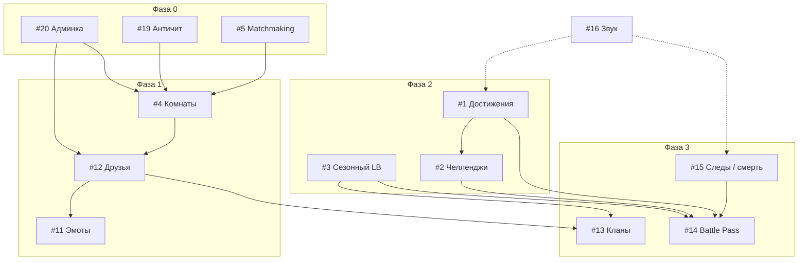

# Roadmap — Multiplayer Ultimate Snake Attack

Документ описывает план развития игры по **14 выбранным направлениям**.  
Статус на момент составления: базовый мультиплеер, магазин, Google-профили, лидерборд, бонусы, боссы, kill feed, кастомные PNG-скины — **готовы**.

**Продакшен:** [dastogram.ru](https://dastogram.ru)  
**Стек:** `server.js` + WebSocket, `public/`, PostgreSQL (`db.js`), Google OAuth (`auth.js`)

---

## Сводка по фазам

| Фаза | Фокус | Фичи | Ориентир |
|------|--------|------|----------|
| **0** | Фундамент и стабильность | #19, #20, #5 | 2–3 недели |
| **1** | Социальное ядро | #4, #12, #11 | 3–4 недели |
| **2** | Удержание и прогресс | #1, #2, #3 | 3–4 недели |
| **3** | Мета-сезон и косметика | #13, #14, #15 | 4–6 недель |
| **4** | Полировка | #16 | 1–2 недели (параллельно с фазами 2–3) |

Оценки — для одного разработчика part-time; при параллельной работе фазы можно сжимать.

---

## Зависимости

---

## Фаза 0 — Фундамент

### #19 · Античит и rate-limit

**Цель:** защитить сервер от спама команд, читов направления и дублирования змеек при reconnect.

| Область | Задачи |
|---------|--------|
| **Сервер** | Лимит input-сообщений (напр. 20/с на сокет); валидация направления (только 90°, не reverse); проверка `frozenUntil` / spawn; отклонение «телепортов» по дельте позиции |
| **Reconnect** | Один активный сокет на `google_sub` / ник; grace period 30 с; старая сессия — disconnect |
| **Логи** | Счётчик нарушений на игрока; при N нарушениях — auto-kick |
| **DB** | Таблица `moderation_flags` (player, reason, ts) — опционально, для связи с админкой |

**Критерии готовности:**
- [ ] Flood 100 msg/s не вешает сервер
- [ ] Reverse и double-turn отбрасываются
- [ ] Reconnect не создаёт вторую змейку
- [ ] Нарушения пишутся в лог / БД

**Файлы:** `server.js`, `db.js`, при необходимости `middleware/rate-limit.js`

---

### #20 · Админ-панель и mod-tools

**Цель:** управление онлайном, модерация, поддержка без правки БД вручную.

| Область | Задачи |
|---------|--------|
| **Auth** | Роль `admin` / `moderator` в `google_users` или env-список `ADMIN_EMAILS` |
| **Страница** | `/admin.html` — только для роли admin |
| **Функции** | Список онлайн-игроков; kick; временный ban (минуты/часы); выдача монет; сброс ника; просмотр последних `moderation_flags` |
| **API** | `GET /api/admin/online`, `POST /api/admin/kick`, `ban`, `grant-coins` — с session + role check |
| **WS** | События `admin_kick`, `admin_notice` клиенту |

**Критерии готовности:**
- [ ] Не-админ получает 403
- [ ] Kick мгновенно убирает игрока с поля
- [ ] Ban блокирует join до expiry
- [ ] Действия аудируются (кто, когда, что)

**Зависимости:** желательно до #4, #12 (модерация комнат и друзей).

**Файлы:** `auth.js`, `server.js`, `db.js`, `public/admin.html`, `public/js/admin.js`

---

### #5 · Matchmaking по сложности

**Цель:** новички не попадают в Insane; игрок выбирает «лobby pool» по сложности.

| Область | Задачи |
|---------|--------|
| **Модель** | `roomPools`: `easy`, `normal`, `hard`, `insane`, `mixed` (текущее поведение) |
| **Лобби UI** | Выбор сложности перед «Играть»; сохранение в `localStorage` |
| **Сервер** | Map `poolId → Set<socket>` или один мир с фильтром: игроки разных pool не коллизят / не видят друг друга **или** отдельные game loops (проще v1: один мир, join только если `player.difficulty` ∈ pool) |
| **v1 (MVP)** | Один мир; при join проверка: если pool `hard`, принимаем только hard/insane |

**Критерии готовности:**
- [ ] Игрок на Easy не сталкивается с Insane в одном pool
- [ ] Счётчик игроков в pool отображается в лобби
- [ ] Смена pool требует rejoin

**Файлы:** `server.js`, `public/js/lobby.js`, `public/index.html`

---

## Фаза 1 — Социальное ядро

### #4 · Приватные комнаты

**Цель:** игра с друзьями по коду комнаты, изолированно от публичного поля.

| Область | Задачи |
|---------|--------|
| **Модель** | `rooms`: `id`, `code` (6 символов), `host`, `maxPlayers`, `difficulty`, `isPrivate`, `createdAt` |
| **WS** | `create_room`, `join_room { code }`, `leave_room`; broadcast state только внутри room |
| **Лобби** | «Создать комнату» / «Войти по коду»; копирование ссылки `?room=ABC123` |
| **Игра** | Отдельный tick loop на room **или** partition players по `roomId` в одном `server.js` |
| **Лимиты** | Макс. 16 игроков; комната удаляется через 30 мин без активности |

**Критерии готовности:**
- [ ] Два кода — два изолированных матча
- [ ] Публичные игроки не видят приватную комнату
- [ ] Host может kick (через #20 или встроенно)

**Зависимости:** #5 (pool/difficulty), #19 (rate-limit), #20 (abuse).

**Файлы:** `server.js`, `db.js` (опционально persist invites), `public/js/lobby.js`

---

### #12 · Друзья и статус «в игре»

**Цель:** добавлять друзей, видеть online / in-game / offline, быстро присоединяться.

| Область | Задачи |
|---------|--------|
| **DB** | `friendships` (user_a, user_b, status: pending/accepted); `presence` (user_id, status, room_code, updated_at) |
| **API** | `POST /api/friends/request`, `accept`, `remove`; `GET /api/friends` |
| **Presence** | Heartbeat с клиента каждые 30 с; при join game → `in_game` + room; disconnect → offline |
| **UI** | Блок «Друзья» в профиле и лобби; кнопка «Присоединиться» если друг в комнате (#4) |
| **Auth** | Только Google-аккаунты (по `google_sub`) |

**Критерии готовности:**
- [ ] Заявка → принятие → друг в списке
- [ ] Статус обновляется ≤ 60 с
- [ ] Join friend ведёт в ту же комнату (если не full / private invite)

**Зависимости:** Google OAuth (есть), #4 для join-by-friend.

**Файлы:** `db.js`, `auth.js`, `server.js`, `public/js/profile.js`, `public/js/lobby.js`

---

### #11 · Быстрые эмоты (без полноценного чата)

**Цель:** лёгкая коммуникация без модерации текста.

| Область | Задачи |
|---------|--------|
| **Набор** | 8–12 preset: «GG», «Осторожно», «Спасибо», «???», emoji-пинги |
| **Клиент** | Колёсико эмотов (Tab / кнопка); cooldown 3 с |
| **Сервер** | `emote { id }` → broadcast `{ playerId, emote, expires }` |
| **Рендер** | Пузырь над головой змейки 3 с (`game.js`) |
| **Anti-spam** | Rate-limit (#19): max 1 emote / 3 с |

**Критерии готовности:**
- [ ] Все в той же room/pool видят эмот
- [ ] Spam блокируется
- [ ] Работает в приватной комнате

**Зависимости:** #4 (scope broadcast), #19.

**Файлы:** `server.js`, `public/js/game.js`, `public/game.html`

---

## Фаза 2 — Удержание и прогресс

### #1 · Достижения

**Цель:** долгосрочные цели, бейджи в профиле, мотивация к разным стилям игры.

| Область | Задачи |
|---------|--------|
| **DB** | `achievements_def` (id, title, desc, icon, tier); `player_achievements` (player, achievement_id, unlocked_at, progress) |
| **Каталог** | ~30 достижений: score, kills, deaths, boss dodge, bonus pickup, games played, difficulty-specific |
| **Триггеры** | Хуки в `server.js`: `onKill`, `onDeath`, `onFood`, `onBonus`, `onGameEnd` |
| **UI** | Сетка в профиле; toast при unlock; редкие — рамка в лидерборде |
| **Награды** | Монеты (разово) + иконка; без pay-to-win |

**Примеры достижений:**

| ID | Условие |
|----|---------|
| `first_blood` | 1 убийство змейки |
| `survivor_100` | 100 игр |
| `insane_500` | 500 очков на Insane |
| `boss_dancer` | 10 смертей от босса (ироничный badge) |
| `fruitarian` | 1000 good food |

**Критерии готовности:**
- [ ] Прогресс сохраняется в PostgreSQL
- [ ] Unlock при reconnect не дублируется
- [ ] Публичный профиль показывает топ-3 badge

**Файлы:** `db.js`, `server.js`, `public/js/profile.js`, `public/profile.html`

---

### #2 · Ежедневные и недельные челленджи

**Цель:** причина заходить каждый день; мягкая выдача монет.

| Область | Задачи |
|---------|--------|
| **DB** | `challenge_templates`; `player_challenges` (player, challenge_id, period_start, progress, claimed) |
| **Ротация** | 3 daily + 1 weekly; seed от UTC-date |
| **Примеры** | «Съешь 30 вишен», «3 игры без смерти от яда», «Набери 200 очков за сессию» |
| **UI** | Виджет в лобbi + профиль; кнопка «Забрать награду» |
| **Связь** | Переиспользовать счётчики из stats + hooks достижений (#1) |

**Критерии готовности:**
- [ ] Сброс daily в 00:00 UTC
- [ ] Weekly с понедельника
- [ ] Claim один раз; награда в `coins`

**Зависимости:** #1 (общие event hooks).

**Файлы:** `db.js`, `server.js`, `public/js/lobby.js`, `public/js/profile.js`

---

### #3 · Сезонный лидерборд

**Цель:** отдельный рейтинг за период; снижает барьер для новичков.

| Область | Задачи |
|---------|--------|
| **DB** | `seasons` (id, name, start_at, end_at); `season_scores` (season_id, player, best_score, coins_earned, kills, …) |
| **Логика** | При game over писать в активный season; best score per player per season |
| **UI** | Вкладки на `leaderboard.html`: «Всё время» / «Сезон N»; таймер до конца сезона |
| **Награды** | Авто-выдача косметики топ-3 при `endSeason()` (рамы, шляпы) |
| **Длина сезона** | 4–6 недель |

**Критерии готовности:**
- [ ] Два сезона не смешивают очки
- [ ] Архив прошлых сезонов read-only
- [ ] Cron / admin trigger для закрытия сезона (#20)

**Зависимости:** stats pipeline (есть), #20 для ручного закрытия.

**Файлы:** `db.js`, `server.js`, `public/js/leaderboard.js`, `public/leaderboard.html`

---

## Фаза 3 — Мета-сезон и косметика

### #13 · Клановые теги

**Цель:** социальная идентичность, командный рейтинг.

| Область | Задачи |
|---------|--------|
| **DB** | `clans` (id, tag, name, owner, color, created_at); `clan_members` (clan_id, user, role) |
| **Правила** | Tag 3–5 символов, unique, `[TAG]` перед ником; max 50 members (v1) |
| **UI** | Страница клана / модалка: создать, пригласить, выйти; клановый LB |
| **Игра** | Отображение `[TAG] Nick` под головой и в kill feed |
| **Рейтинг** | Сумма best season score членов или отдельная таблица `clan_season_scores` |

**Критерии готовности:**
- [ ] Один кlan на игрока
- [ ] Tag виден в игре и лидерборде
- [ ] Owner может kick / transfer

**Зависимости:** #12 (invite friends), #3 (season scores).

**Файлы:** `db.js`, `server.js`, `public/clan.html`, `public/js/clan.js`, `public/js/game.js`

---

### #14 · Battle Pass (сезонный трек)

**Цель:** монетизация/удержание через косметику; бесплатная + премиум ветка.

| Область | Задачи |
|---------|--------|
| **DB** | `battle_pass_seasons`; `bp_tiers` (season, tier, xp_required, free_reward, premium_reward); `player_bp` (xp, premium_unlocked, claimed_tiers) |
| **XP** | Игры, челленджи (#2), достижения (#1) |
| **Награды** | Только косметика: шляпы, следы (#15), рамки аватарки, emoji |
| **Premium** | v1: unlock кодом / admin grant; v2: платёж (Stripe / ЮKassa) — **не в MVP** |
| **UI** | `/battlepass.html` — дорожка tier 1–30, progress bar |

**Критерии готовности:**
- [ ] XP копится в рамках сезона (#3)
- [ ] Claim tier не дублируется
- [ ] Free track доступен всем; premium — opt-in

**Зависимости:** #1, #2, #3, #15 (rewards).

**Файлы:** `db.js`, `server.js`, `public/battlepass.html`, `public/js/battlepass.js`

---

### #15 · Следы и эффекты смерти

**Цель:** новая категория косметики в магазине и Battle Pass.

| Область | Задачи |
|---------|--------|
| **Каталог** | `SHOP_CATALOG`: category `trail`, `death_fx` (8–12 предметов) |
| **Trail** | Переопределить `SnakeFX.updateTrails` — цвет/particulate по `equipped.trailId` |
| **Death FX** | При kill/death — burst particles (без shadowBlur, FPS-safe) |
| **Custom PNG** | Опционально: `public/custom-trails/` по аналогии с `custom-skins/` |
| **Профиль** | Превью на canvas как у скинов |

**Критерии готовности:**
- [ ] Trail виден у себя и у других
- [ ] Death FX ≤ 5 ms на событие
- [ ] Экипировка через магазин / BP

**Зависимости:** магазин (есть), #14 для части наград.

**Файлы:** `server.js`, `public/js/fx.js`, `public/js/game.js`, `public/js/shop.js`

---

## Фаза 4 — Полировка (параллельно)

### #16 · Звук и музыка по событиям

**Цель:** feedback на действия; опциональная атмосфера.

| Область | Задачи |
|---------|--------|
| **SFX** | eat good/bad, bonus pickup, kill, death, boss near, emote, achievement unlock |
| **Music** | Looped ambient; mute / volume в лобbi (частично есть `audio.js`) |
| **Файлы** | `public/audio/sfx/*.ogg`, `public/audio/music/*.ogg` |
| **API** | `AudioManager.play(eventId)` — pool 3–4 одновых звука max |
| **Настройки** | SFX / Music sliders отдельно в `SnakeStore` |

**Критерии gотовности:**
- [ ] Звук не лагает игру (async decode)
- [ ] Respect `prefers-reduced-motion` / mute
- [ ] Kill и achievement — distinct SFX

**Файлы:** `public/js/audio.js`, `public/js/game.js`, `public/js/lobby.js`, assets

---

## Сквозные технические задачи

Выполняются по мере прохождения фаз:

| Задача | Когда |
|--------|--------|
| Миграции PostgreSQL (`scripts/migrate-*.js`) | Каждая фича с новыми таблицами |
| Индексы на `name_lower`, `google_sub`, `season_id` | Фаза 2–3 |
| Версионирование WS-протокола (`protocolVersion` в hello) | Фаза 1 |
| Feature flags в env (`ENABLE_CLANS=1`) | Фаза 3 |
| Обновление `README.md` / `guide.md` | После каждой фазы |

---

## Предлагаемый порядок спринтов

| Спринт | Deliverable |
|--------|-------------|
| **S1** | #19 rate-limit + reconnect fix |
| **S2** | #20 admin MVP (online, kick, ban) |
| **S3** | #5 difficulty pools в лобби |
| **S4** | #4 private rooms v1 |
| **S5** | #12 friends + presence |
| **S6** | #11 emotes |
| **S7** | #1 achievements (20 шт.) |
| **S8** | #2 daily/weekly challenges |
| **S9** | #3 season 1 + UI |
| **S10** | #15 trails + death fx |
| **S11** | #14 battle pass free track |
| **S12** | #13 clans v1 |
| **S13** | #16 SFX pack + polish |

---

## Метрики успеха

| Метрика | Цель после фазы 2 | Цель после фазы 3 |
|---------|-------------------|-------------------|
| DAU / WAU | +30% от baseline | +60% |
| Средняя длина сессии | +15% | +25% |
| Return D1 | 25% | 35% |
| Игр с друзьями (#4+#12) | 20% сессий | 40% |
| Claim daily challenge | — | 50% DAU |

*(Baseline зафиксировать до старта фазы 2 — простой counter в admin.)*

---

## Вне scope (осознанно отложено)

- Полноценный текстовый чат с фильтром
- Платёжный Battle Pass premium (до стабилизации free track)
- Мобильные touch-controls
- Replay / kill-cam
- Отдельные game servers / sharding

---

## Связанные документы

| Документ | Описание |
|----------|----------|
| [README.md](README.md) | Общее описание проекта |
| [public/custom-skins/guide.md](public/custom-skins/guide.md) | Кастомные PNG-скины и шляпы |

---

*Последнее обновление roadmap: июнь 2026.*
